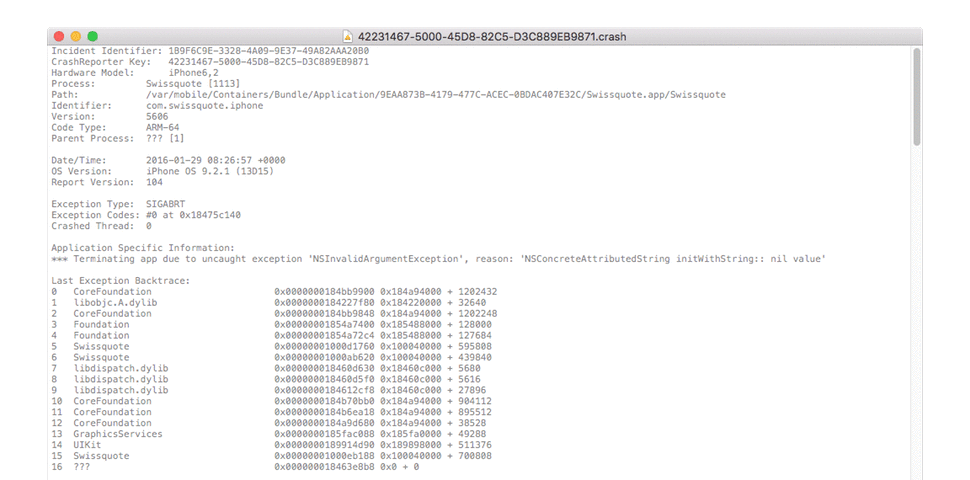

# CrashReports
Symbolicate iOS Crash Reports

CrashReports is a Cocoa wrapper over Apple's `symbolicatecrash.pl`.

It can convert addresses into symbols in iOS crash reports, such as the ones generated by [PLCrashReporter](https://www.plcrashreporter.org/).

CrashReports assumes that the `.xcarchive` is indexed by Spotlight. 

Also, `otool`, `atos`, `lipo` and `size` should be in their default location.

If not, edit `symbolicatecrash.pl`:

    $otool = "/Applications/Xcode.app/Contents/Developer/Toolchains/XcodeDefault.xctoolchain/usr/bin/otool";
    $atos  = "/Applications/Xcode.app/Contents/Developer/usr/bin/atos";
    $lipo  = "/Applications/Xcode.app/Contents/Developer/Toolchains/XcodeDefault.xctoolchain/usr/bin/lipo";
    $size  = "/Applications/Xcode.app/Contents/Developer/Toolchains/XcodeDefault.xctoolchain/usr/bin/size";
